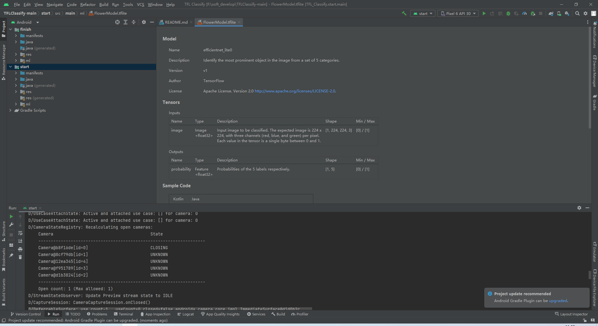

typora-copy-images-to: ./images

# 基于TensorFlow Lite实现的Android花卉识别应用

## 介绍
### 本教程将在Android设备上使用TensorFlow Lite运行图像识别模型，具体包括：

- 使用TensorFlow Lite Model Maker训练自定义的图像分类器
- 利用Android Studio导入训练后的模型，并结合CameraX使用
- 利用手机GPU加速模型运行


手机通过USB接口连接开发平台，并设置手机开发者选项允许调试。

选择真实物理机（而不是模拟器）运行start模块

允许应用获取手机摄像头的权限，得到下述效果图，界面利用随机数表示虚拟的识别结果。


## 向应用中添加TensorFlow Lite

1. 选择"start"模块

   

2. 右键“start”模块，或者选择File，然后New>Other>TensorFlow Lite Model

   

3. 选择已经下载的自定义的训练模型。本教程模型训练任务以后完成，这里选择finish模块中ml文件下的FlowerModel.tflite。

   

4. 点击“Finish”完成模型导入，系统将自动下载模型的依赖包并将依赖项添加至模块的build.gradle文件。

5. 最终TensorFlow Lite模型被成功导入，并生成摘要信息

   

   ## 检查代码中的TODO项

本项目初始代码中包括了若干的TODO项，以导航项目中未完成之处。为了方便起见，首先查看TODO列表视图，View>Tool Windows>TODO


默认情况下了列出项目所有的TODO项，进一步按照模块分组（Group By）


## 添加代码重新运行APP

1. 定位“start”模块**MainActivity.kt**文件的TODO 1，添加初始化训练模型的代码

   ```
   private val flowerModel = FlowerModel.newInstance(ctx)
   ```

   

2. 在CameraX的analyze方法内部，需要将摄像头的输入`ImageProxy`转化为`Bitmap`对象，并进一步转化为`TensorImage` 对象

   ```
   override fun analyze(imageProxy: ImageProxy) {
     ...
     // TODO 2: Convert Image to Bitmap then to TensorImage
     val tfImage = TensorImage.fromBitmap(toBitmap(imageProxy))
     ...
   }
   ```

   

3. 对图像进行处理并生成结果，主要包含下述操作：

   - 按照属性`score`对识别结果按照概率从高到低排序
   - 列出最高k种可能的结果，k的结果由常量`MAX_RESULT_DISPLAY`定义

4. 将识别的结果加入数据对象`Recognition` 中，包含`label`和`score`两个元素。后续将用于`RecyclerView`的数据显示

5. 将原先用于虚拟显示识别结果的代码注释掉或者删除

6. 以物理设备重新运行start模块

7. 最终运行效果

   运行结果如下：

  

